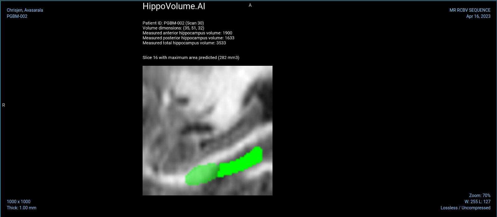
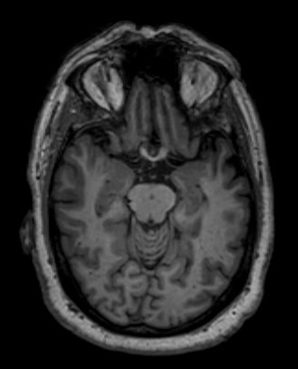

<div id="top"></div>

<!-- PROJECT LOGO -->
<br />
<div align="center">
  <h3 align="center">Quantifying Alzheimer's Disease Progression Through Automated Measurement of Hippocampal Volume</h3>
  
</div>

<!-- TABLE OF CONTENTS -->
<details>
  <summary>Table of Contents</summary>
  <ol>
    <li>
      <a href="#about-the-project">About The Project</a>
      <ul>
        <li><a href="#premise">Premise</a></li>
        <li><a href="#data">Data</a></li>
        <li><a href="#execution-plan">Execution Plan</a></li>
        <li><a href="#challenges-and-improvements">Challenges and improvements</a></li>
      </ul>
    </li>
    <li>
      <a href="#getting-started">Getting Started</a>
      <ul>
        <li><a href="#setting-up-a-conda-environment">Setting up a conda environment</a></li>
        <li><a href="#usage">Usage</a></li>
        <li><a href="#file-descriptions">File descriptions</a></li>
      </ul>
    </li>
    <li><a href="#additional-notes">Additional Notes</a></li>
    <li><a href="#license">License</a></li>
    <li><a href="#contact">Contact</a></li>
    <li><a href="#acknowledgments">Acknowledgments</a></li>
  </ol>
</details>

---

## About The Project

In this mini-project, I developed a machine learning model to estimate the hippocampal volume on MRI images to quantify Alzheimer's disease progression. I start by first exploring the dataset for this task, then by training a segmentation model (voxel classifier) and finally I integrate the results of the model by generating a DICOM report on a patient study that can be viewed by clinicians.

### Premise

Alzheimer's disease (AD) is a progressive neurodegenerative disorder that results in impaired neuronal (brain cell) function and eventually, cell death. AD is the most common cause of dementia. Clinically, it is characterized by memory loss, inability to learn new material, loss of language function, and other manifestations.

For patients exhibiting early symptoms, quantifying disease progression over time can help direct therapy and disease management.

A radiological study via MRI exam is currently one of the most advanced methods to quantify the disease. In particular, the measurement of hippocampal volume has proven useful to diagnose and track progression in several brain disorders, most notably in AD. Studies have shown reduced volume of the hippocampus in patients with AD.

The hippocampus is a critical structure of the human brain (and the brain of other vertebrates) that plays important roles in the consolidation of information from short-term memory to long-term memory. In other words, the hippocampus is thought to be responsible for memory and learning (that's why we are all here, after all!)


Humans have two hippocampi, one in each hemishpere of the brain. They are located in the medial temporal lobe of the brain. Fun fact - the word "hippocampus" is roughly translated from Greek as "horselike" because of the similarity to a seahorse, a peculiarity observed by one of the first anatomists to illustrate the structure.


According to [studies](https://www.sciencedirect.com/science/article/pii/S2213158219302542), the volume of the hippocampus varies in a population, depending on various parameters, within certain boundaries, and it is possible to identify a "normal" range when taking into account age, sex and brain hemisphere.


There is one problem with measuring the volume of the hippocampus using MRI scans, though - namely, the process tends to be quite tedious since every slice of the 3D volume needs to be analyzed, and the shape of the structure needs to be traced. The fact that the hippocampus has a non-uniform shape only makes it more challenging. Do you think you could spot the hippocampi in this axial slice?



As you might have guessed by now, we are going to build a piece of AI software that could help clinicians perform this task faster and more consistently.

A large part of AI development effort is taken up by curating the dataset and proving clinical efficacy. In this project, we will focus on the technical aspects of building a segmentation model and integrating it into the clinician's workflow, leaving the dataset curation and model validation questions largely outside the scope of this project.

<p align="right">(<a href="#top">back to top</a>)</p>

### Data

We are using the "Hippocampus" dataset from the [Medical Decathlon competition](http://medicaldecathlon.com/). This dataset is stored as a collection of NIFTI files, with one file per volume, and one file per corresponding segmentation mask. The original images here are T2 MRI scans of the full brain. As noted, in this dataset we are using cropped volumes where only the region around the hippocampus has been cut out. This makes the size of our dataset quite a bit smaller, our machine learning problem a bit simpler and allows us to have reasonable training times. You should not think of it as "toy" problem, though. Algorithms that crop rectangular regions of interest are quite common in medical imaging. Segmentation is still hard.

<p align="right">(<a href="#top">back to top</a>)</p>

### Execution plan

In this project we will build an end-to-end AI system which features a machine learning algorithm that integrates into a clinical-grade viewer and automatically measures hippocampal volumes of new patients, as their studies are committed to the clinical imaging archive.

Fortunately we won't have to deal with full heads of patients. Our (fictional) radiology department runs a HippoCrop tool which cuts out a rectangular portion of a brain scan from every image series, making our job a bit easier, and our committed radiologists have collected and annotated a dataset of relevant volumes, and even converted them to NIFTI format!

We will use the dataset that contains the segmentations of the right hippocampus and we will use the U-Net architecture to build the segmentation model. But before that, we will be exploring the dataset and identifying noisy, incorrect and outlier samples.

Finally, we will proceed to integrate the model into a working clinical PACS such that it runs on every incoming study and produces a report with volume measurements.

### Challenges and improvements

The dataset used for this project were fairly clean and didn't require any elaborate pre-processing. Only a few samples had to be discarded due to issues in the volumes or because of mismatched volumes and masks.

We used a default U-net architecture, which achieved quite reasonable performance with an average Dice's coefficient score over 0.90 on the test set. However, further improvements are possible, ranging from data augmentation to tuning the different learning hyper-parameters (e.g. optimizer choice, learning rate, etc.) as well as changing the U-Net layers or even using a different architecture such as [DeepMedic](https://www.sciencedirect.com/science/article/pii/S1361841516301839).

We generated a rather simple final report for clinicians. This could be easily expanded using the vast array of metadata available for each patient in the respective DICOM file. Furthermore, with some domain-knowledge, we could include more varied images showing the most relevant slices to be examined by the clinicians, as well as the segmented area of each such slide.

<p align="right">(<a href="#top">back to top</a>)</p>

---

## Getting Started

To make use of this project, I recommend managing the required dependencies with Anaconda.

### Setting up a conda environment

Install miniconda:

```bash
wget https://repo.anaconda.com/miniconda/Miniconda3-latest-Linux-x86_64.sh
bash Miniconda3-latest-Linux-x86_64.sh
```

Install mamba:

```bash
conda install -n base -c conda-forge mamba
```

Install environment using provided file:

```bash
mamba env create -f environment.yml # alternatively use environment_hist.yml if base system is not debian
mamba activate hyppocampal-vol-quant
```

### Usage

This project was divided into three sections:

1. Data Exploratory Analysis, which can be run through the following notebook: `notebooks/1_EDA.ipynb`.
2. Training U-Net segmentation model, which can be done by running the following command: `python src/run_ml_pipeline.py`.
3. Inference on a DICOM study, , which can be done by running the following command: `python src/inference_dcm.py data/test_volumes/Study1`.

### File descriptions

The project files are structured as follows:

- `assets`: Necessary assets to generate final report.
- `data`: Here resides the original dataset, the test study volumes as well as all the relevant output.
  - `data/training_set`: Contains the original dataset, divided into images and masks.
  - `data/test_volumes`: Contains the DICOM volumes used to test the inference section.
  - `data/output`: Contains the generated files for each section.
- `images`: Images used throught this README.
- `notebooks`: Location of the main project notebook.
- `src`: Contains all the functions and clases used throughout the project to complete each of the sections. It also contains the aforementioned `run_ml_pipeline.py` and `inference_dcm.py` scripts.

<p align="right">(<a href="#top">back to top</a>)</p>

---

## Additional Notes

Source files formatted using the following commands:

```bash
isort .
autoflake -r --in-place --remove-unused-variable --remove-all-unused-imports --ignore-init-module-imports .
black .
```

## License

Distributed under the MIT License. See `LICENSE` for more information.

## Contact

[Carlos Uziel Pérez Malla](https://www.carlosuziel-pm.dev/)

[GitHub](https://github.com/CarlosUziel) - [Google Scholar](https://scholar.google.es/citations?user=tEz_OeIAAAAJ&hl=es&oi=ao) - [LinkedIn](https://at.linkedin.com/in/carlos-uziel-p%C3%A9rez-malla-323aa5124) - [Twitter](https://twitter.com/perez_malla)

## Acknowledgments

This project was done as part of the [AI for Healthcare Nanodegree Program at Udacity](https://www.udacity.com/course/ai-for-healthcare-nanodegree--nd320).

<p align="right">(<a href="#top">back to top</a>)</p>
